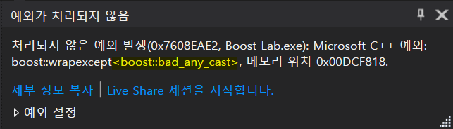

# Boost::Any Algorithm 분석

## 사용방법

Array를 통한 Any의 기본적인 사용
```C++
#include <boost/any.hpp>
#include <vector>
#include <iostream>
#include <string>

using std::cout;
using std::endl;
using std::string;
using boost::any;
using boost::any_cast;

void ArrayExample()
{
    any ExampleArray[10];

    ExampleArray[0] = 23;
    ExampleArray[1] = "How old are you?";
    ExampleArray[2] = 178.7;

    int i = any_cast<int>(ExampleArray[0]);

    cout << i << endl;
}

int main() {
    ArrayExample();

    return 0;
}
```

```C++
any ExampleArray[10];
```
boost:any를 자료형으로 하여 Container, 또는 배열을 선언할 수 있다.

```C++
ExampleArray[0] = 23;
ExampleArray[1] = "How old are you?";
ExampleArray[2] = 178.7;
```
순서대로 `int`,`string`,`float`형 데이터를 배열에 대입하였다.

```C++
int i = any_cast<int>(ExampleArray[0]);
```
만약 이렇게 저장된 데이터를 특정 자료형이 필요한 곳에 사용하려면 casting이 필요하다.
이때 any_cast()를 사용하여 Casting해주면 된다.
이때 any_cast 뒤에 <>로 Casting 할 자료형을 명시해줘야 한다.

```C++
//ExampleArray[1] 에는 String 데이터가 들어있다.
any_cast<int>(ExampleArray[1]);
```
만약 변환할 수 없는 자료형으로 Casting을 시도할 경우 `bad_any_cast` Exception을 Throw 한다.


