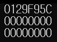

# Boost::Any Algorithm 분석
## Array를 통한 Any의 기본적인 사용

## 1. boost:any를 사용한 변수 생성하고, 수정하기
```C++
any ExampleArray[10];

ExampleArray[0] = 23;
ExampleArray[1] = string("How old are you?");
ExampleArray[2] = 178.7f;
//순서대로 **int**,**string**,**float**형 데이터를 배열에 대입하였다.
```
이처럼 boost:any를 DataType으로 하여 Container, 또는 배열과 같은 데이터 저장소를 간단히 선언할 수 있다.

---

## 2. any 타입 데이터를 원하는 자료형으로 캐스팅하기 
만약 저장된 데이터를 특정 자료형이 필요한 곳으로 가져오고 싶다면 casting이 필요하다.  
boost:any는 값을 2가지 방법으로 가져올 수 있는데, 값을 반환하는 방식 그리고 포인터를 반환하는 방식이다.
### 2-1. 값을 반환   
```C++
int i = any_cast<int>(ExampleArray[0]);
```
이때 any_cast function를 사용하여 Casting해주면 된다.   
이때 any_cast 뒤에 <>로 Casting 할 자료형을 명시해줘야 한다.

값을 반환하는 방식은 위와 같고 변환하는 타입이 맞지 않으면 [bad_any_cast](#bad_any_cast) exception을 던진다.   


### 2-2. 포인터를 반환
```C++
int* i1 = any_cast<int>(&ExampleArray[0]);
int* i2 = any_cast<int>(&ExampleArray[1]);
int* i3 = any_cast<int>(&ExampleArray[2]);
```
위와 같이 코드를 작성한뒤 실행을 시킨 결과는 다음과 같다.   
   
1번째 줄은 int형 데이터로 변환하였기에 값이 저장되어있는 메모리 주소를 출력하였지만,  
이외는 NULL을 반환하였으므로 0이 출력되었다.   
이처럼 포인터를 반환하는 방식은 타입이 맞지 않더라도 Exception을 던지지 않고, NULL 포인터를 반환한다.

---

## 3. Bad_Any_Cast <a name="bad_any_cast"></a>
### 3-1. Exception Throw
```C++
//ExampleArray[1] 에는 String 데이터가 들어있다.
any_cast<int>(ExampleArray[1]);
```

만약 변환할 수 없는 자료형으로 Casting을 시도할 경우 ``bad_any_cast`` Exception을 Throw 한다.
><br>
>*위 이미지는 throw 를 catch하지 않았을 때 나오는 error*

### 3-2. 헤더파일 분석
```c++
namespace boost {
   class BOOST_SYMBOL_VISIBLE bad_any_cast :
   {
   public:
       const char * what() const BOOST_NOEXCEPT_OR_NOTHROW BOOST_OVERRIDE
       {
           return "boost::bad_any_cast: "
                  "failed conversion using boost::any_cast";
        }
   };
}
```
우리가 익히 알고 있는 클래스의 정의가 bad_any_cast라는 이름의 클래스로 정의되어있다.   
define되어있는 `BOOST_SYMBOL_VISIBLE`, `BOOST_NOEXCEPT_OR_NOTHROW`, `BOOST_OVERRIDE`는 다른 분석을통해 알아볼 예정이다.   
우선 유일하게 있는 멤버함수 `const char * what()`이 있다.   
이 함수 뒤에는 **const**가 붙어있는데, 이는 함수에서 다음과 같은 기능을 한다.
>1. 객체의 내부의 변수를 수정할 수 없음
>2. const함수만 호출 가능   

이러한 기능 때문에 **Getter** 또는 **bool** 반환값에 많이 사용되는데, 이 경우에는 정해져있는 예외의 정보를 반환하기위해 사용하였다.

### 3-3. Throw된 예외처리하기
```c++
try {
        string s1 = any_cast<string>(ExampleArray[1]);
        cout << s1 << endl;
    }
    catch (boost::bad_any_cast& except) {
        cout << except.what() << endl;

    }
```
간단한 try-catch 문장을 작성하였다.   
만약 bad_any_cast에 해당하는 casting을 할 경우 boost::any에서 예외를 발생시킨다.   
그 예외를 catch로 받아내서 처리하는 문장이다.

이 catch에는 매개변수로 `boost::bad_any_cast`를 사용할 수 있는데, 이 클래스를 참조변수로 받아와   
`what()`을 사용하여 bad_any_cast에서 설정된 오류메세지를 출력 할 수 있다.


